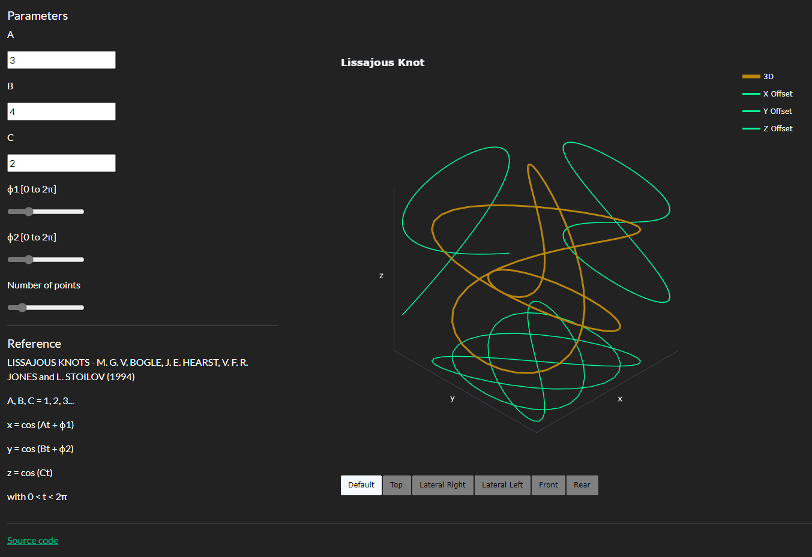

# Lissajous Knots
by Rinaldi Petrolli

## Description
Interactive visualizer for 3D Lissajous Knots.

## Installation and Usage
1. Install all dependencies listed in `requirements.txt` - all packages are pip-installable.
2. Run `app.py` to launch a local Dash server to host the Dash app. A link will appear in your console; click this to use the Dash app.

## Illustration
